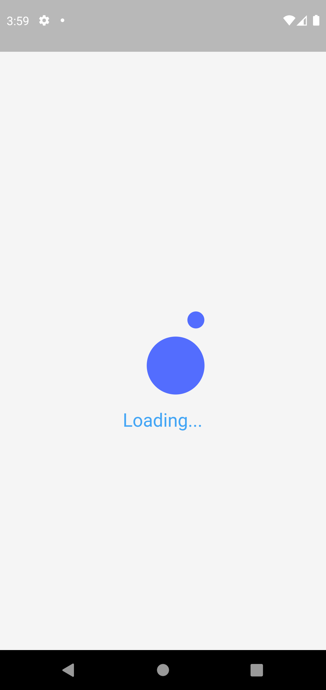
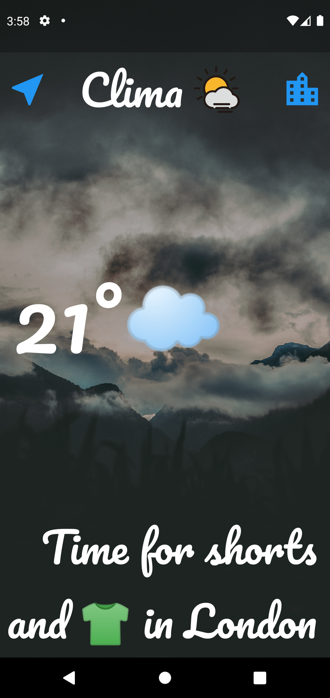
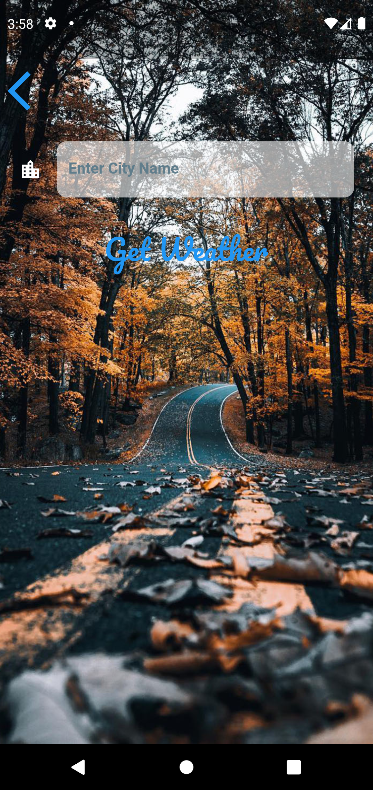

# Clima (Weather Application).

It's a multi platform weather Application which is powered by Flutter and OpenWeather's API, with support for 6 platform'support.

## Demo

All the working screens are shown below.

  
## Screenshots

Splash Screen            |  Loading Screen       | Android Main Screen   | Android Second Screen      | 
:-------------------------:|:-------------------------:|:----------------------:|:-------------------------:|
   |  |    |  | 
  
Desktop Main Screen       | Desktop Second Screen    |    
:-------------------------:|:----------------------:|
 | 
  
  | Web Main Screen    |    
  |:----------------:|
  
  
  Web Second Screen    |    
  :----------------:|
  
  

## Features

- Platform Adaptive Backgrounds.
- Tested on 3 Platform with support for 6.
- Current weather with some Message and emojis.
  
## Acknowledgements

 - OpenWeather API
 - Unsplash (for backgrounds)
  
